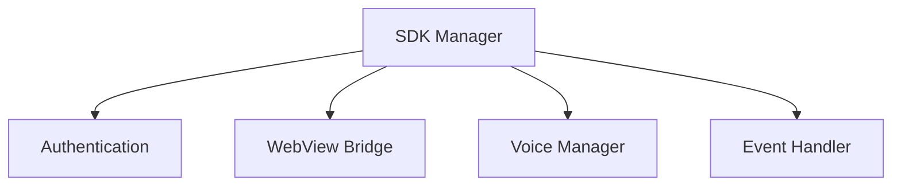
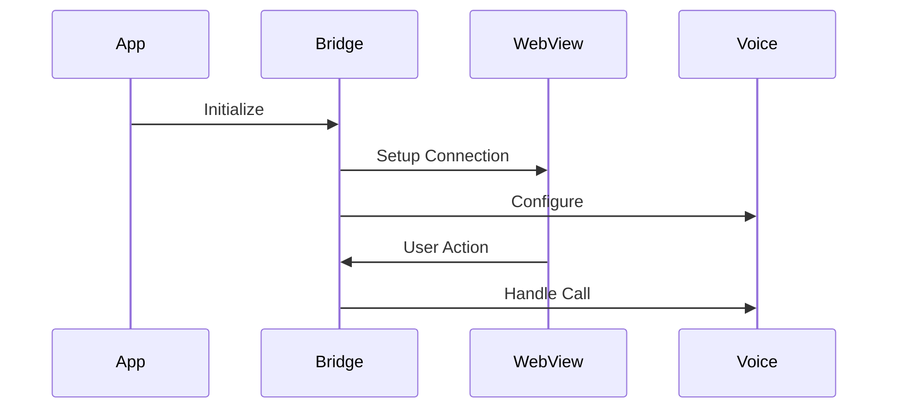
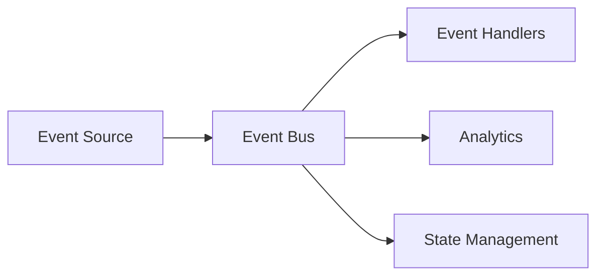
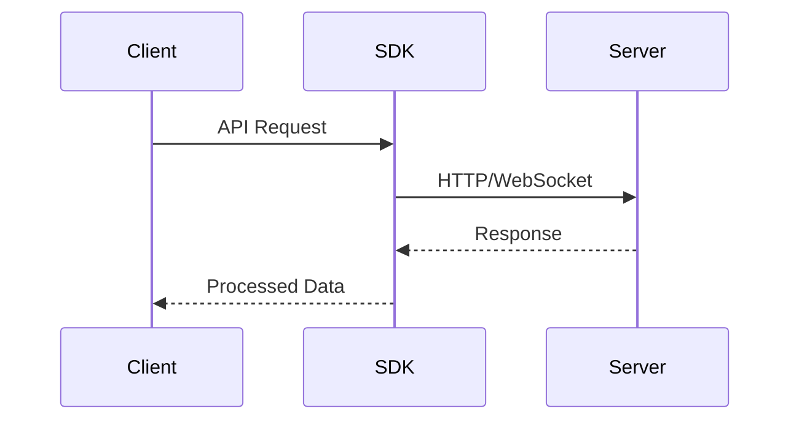

# Key Concepts

## Overview

The Squad SDK enables seamless integration of social features and voice calling capabilities into mobile applications. This guide covers the fundamental concepts and architecture that form the foundation of the Squad SDK.

## Core Components

### 1. SDK Manager

The SDK Manager is the central component that handles:

- SDK initialization
- Configuration management
- Resource coordination
- Lifecycle management



### 2. WebView Integration

The Squad experience is delivered through a WebView component that:

- Provides the user interface
- Handles user interactions
- Manages navigation
- Coordinates with native features

### 3. Bridge Architecture

The Bridge system facilitates communication between:

- Native SDK components
- WebView content
- Voice calling features
- Parent application



## Key Features

### 1. Authentication Flow

Squad SDK supports multiple authentication methods:

- Email-based authentication
- Token-based authentication
- Session management
- Secure credential storage

### 2. Voice Calling (Squad Line)

Voice calling features include:

- Real-time communication
- Custom call titles
- Emoji reactions
- Call quality management

### 3. Social Features

Integrated social capabilities:

- Freestyles
- Polls
- Squad management
- Friend connections

## Architecture Patterns

### 1. Event-Driven Architecture



The SDK uses an event-driven architecture to:

- Handle user interactions
- Manage state changes
- Coordinate components
- Track analytics

### 2. State Management

State management encompasses:

- User session state
- Call state
- WebView state
- Connection state

## Integration Lifecycle

### 1. Initialization Phase

```kotlin
// 1. SDK Initialization
SquadSDK.initialize(config)

// 2. User Authentication
SquadSDK.authenticate(credentials)

// 3. WebView Presentation
SquadSDK.presentWebView()
```

### 2. Runtime Phase

During runtime, the SDK manages:

- State synchronization
- Event handling
- Resource management
- Error recovery

### 3. Cleanup Phase

Proper cleanup includes:

- Resource release
- State persistence
- Connection termination
- Cache management

## Data Flow

### 1. Client-Server Communication



### 2. WebView-Native Bridge

The bridge facilitates:

- Bi-directional communication
- Event synchronization
- State management
- Resource sharing

## Security Model

### 1. Authentication Security

- Secure credential storage
- Token management
- Session handling
- Access control

### 2. Data Security

- End-to-end encryption
- Certificate pinning
- Secure storage
- Data privacy

## Best Practices

### 1. Implementation Guidelines

- Initialize SDK early in app lifecycle
- Handle lifecycle events properly
- Implement proper error handling
- Manage resources efficiently

### 2. Performance Optimization

- Optimize memory usage
- Manage network efficiently
- Handle background states
- Cache appropriately

## Advanced Concepts

### 1. Custom Integration

Customization options include:

- UI/UX customization
- Custom event handling
- Analytics integration
- Error handling

### 2. Advanced Features

Advanced capabilities:

- Background processing
- Push notifications
- Deep linking
- State restoration

## Platform Considerations

### iOS-Specific Concepts

- View controller hierarchy
- Memory management
- Background tasks
- App lifecycle

### Android-Specific Concepts

- Activity/Fragment lifecycle
- Process lifecycle
- Configuration changes
- Memory constraints

## Next Steps

- Review [SDK Initialization](../sdk-init.md)
- Explore [Authentication](../user-init.md)
- Learn about [WebView Integration](../webview-integration.md)

## Additional Resources

- [iOS Implementation Guide](../ios/implementation.md)
- [Android Implementation Guide](../android/implementation.md)
